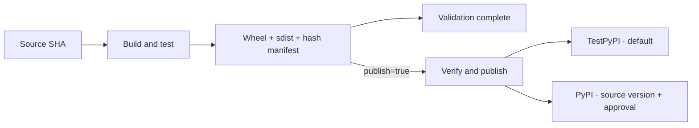

# HugeGraph Actions

Shared workflows for publishing HugeGraph Docker images and Python packages, validating releases, and repository automation.

## Image publishing architecture


Wrappers define when and what to publish; the two reusable workflows implement image building and validation. Each run resolves its source repository/ref to a fixed commit.

## Docker images

Thin component wrappers call either [the standard image publisher](.github/workflows/_publish_image_reusable.yml) or [the PD/Store/Server publisher](.github/workflows/_publish_pd_store_server_reusable.yml).

| Mode | Trigger | Source and tag | Unchanged source |
| --- | --- | --- | --- |
| Latest | Scheduled or manual | Default source uses `latest`; other refs can derive a tag or use `image_tag` | Skipped only for the configured default source without an explicit tag |
| Release | Manual | Explicit `source_ref`; standard images can derive the version, PD/Store/Server requires `image_tag=x.y.z` | Always runs |

Manual latest runs default to validation (`publish=false`): build all configured platforms and read caches without pushing images, exporting caches, or updating `LAST_*_HASH`. Scheduled runs publish automatically. Set `publish=true` to publish manually; use an explicit `image_tag` for branch builds.

Use `source_repository` to select the component's Apache or HugeGraph repository and `source_ref` for a branch, tag or commit. The resolved source SHA and destination `image_tag` are independent.

The standard publisher selects Dockerfiles, build contexts, platforms and optional smoke tests through `build_matrix_json`. Images carry OCI source/revision labels. Successful latest publications can update `LAST_*_HASH`.

### PD/Store/Server validation

```text
Resolve source SHA and tag
  → Build/load PD, Store, HStore Server and standalone Server (amd64 + arm64)
  → Run local compose, example graph and Gremlin CRUD checks
  → Smoke-test standalone Server
  → Push the same multi-platform candidates
  → Update latest hash, when enabled
```

Sources with `docker/bake.hcl` share one native Maven build and registry cache (`hugegraph/hugegraph:shared-<channel>`); older sources use the per-Dockerfile path. Compose uses `docker/docker-compose.dev.yml` with `pull_policy: never`, or the compatible `docker/docker-compose.yml` fallback.

The precheck imports the bundled `example.groovy`, verifies its 6 vertices/6 edges, and exercises Gremlin CRUD before returning to that baseline. Runtime checks use the locally loaded amd64 images. Only successful candidates are pushed, without rebuilding or temporary architecture tags.

The runner uses 1 PD + 1 Store + 1 Server, with 1 GiB each for PD/Store and 1.5 GiB for Server. These are CI limits, not production sizing. A full 3+3+3 topology requires a larger runner or another validated test setup.

### Multi-platform builds

Use `FROM --platform=$BUILDPLATFORM` for portable build stages so Maven/Node packaging runs natively; leave runtime stages on the target platform. Native libraries, JNI/CGO and architecture-specific downloads need cross-compilation or native target runners plus runtime tests. See [Docker's build strategies](https://docs.docker.com/build/building/multi-platform/) and [platform arguments](https://docs.docker.com/reference/dockerfile/#automatic-platform-args-in-the-global-scope).

## Python packages

[`publish_python.yml`](.github/workflows/publish_python.yml) builds and validates `hugegraph-python` (client) or `hugegraph-mcp` (MCP), with opt-in publishing. Both use the same artifact verification and upload path.

| Input | Default | Meaning |
| --- | --- | --- |
| `component` | `client` | `client` → `hugegraph-python-client` / `hugegraph-python`; `mcp` → `hugegraph-mcp` |
| `source_repository` | `apache/hugegraph-ai` | Choose the Apache repository or `hugegraph/hugegraph-ai` for pre-merge validation |
| `publish` | `false` | Validate and retain artifacts; enable explicitly to upload |
| `source_ref` | `main` | Branch, tag or SHA; resolved to an immutable commit |
| `target` | `testpypi` | `testpypi` or `pypi`; both accept a source branch, tag or SHA |
| `test_version` | Empty | Shared client/MCP version for TestPyPI, e.g. `1.7.1.1`; must be empty for PyPI |

Test versions use `x.y.z.n`, extending the source version with a fourth number only in the CI checkout. Choose a new number when testing changed code; there is no automatic numbering. Production reads `x.y.z` directly from the selected source commit's metadata, with no version override or tag requirement. Four-part versions are a convention for TestPyPI, not Python prerelease markers.

Fork sources (`hugegraph/hugegraph-ai`) can be validated with `publish=false` or published to TestPyPI. Public PyPI uploads require `apache/hugegraph-ai`; the publisher rejects fork sources before network access or uploading.

Validation runs (`publish=false`) skip the publish job, so they do not request environment approval or receive an upload token. They still perform all build/install/smoke checks and retain artifacts.

Create environments `testpypi` and `pypi`, each containing `PYPI_API_TOKEN`. Restrict `pypi` deployments to the `master` branch of this repository and require maintainer approval with admin bypass disabled; `testpypi` allows branch validation. This restriction applies to the workflow branch, not the source package ref. Only the upload step receives the selected token. Each token must authorize the selected package; a token scoped only to `hugegraph-python` cannot publish `hugegraph-mcp`.



The build job uses uv, checks wheel/sdist with Twine, records their hashes, and runs isolated wheel/sdist installations on Python 3.10/3.11. Client releases run unit/contract tests against the installed package. MCP releases first run the source revision's client vertex-ID, schema and distribution contract tests against the downloaded client in each isolated environment; only the three test files are copied, with no client source or repository pytest configuration. They then run the source revision's `hugegraph-mcp/tests/distribution_smoke.py` against each installed console entry point and a fresh `uvx --from <wheel> hugegraph-mcp` process; it checks MCP initialization, tool discovery, inspect and query calls against an HTTP fixture without requiring a live HugeGraph server. It verifies the artifacts again after tests. The publish job checks the manifest and remote filenames/hashes before uploading those exact artifacts. Unexpected remote files or conflicting hashes fail; identical files are skipped. For partial uploads, **re-run failed jobs** to reuse the original artifacts.

### Client and MCP release order

For `target=pypi`, all dependencies come from **public PyPI**. For MCP `target=testpypi`, the workflow fetches the exact published client wheel identified by the same `test_version` from TestPyPI, verifies its metadata and SHA-256, and installs it by a hash-pinned direct URL. All other dependencies still come from public PyPI; there is no mixed-index lookup or local client fallback. TestPyPI success verifies the test-channel pair, not public PyPI availability. The selected source must include the distribution smoke script for MCP validation.

To rehearse uploads, first publish client with `target=testpypi`, `test_version=1.7.1.1`, then MCP with the same values. For another test version (e.g. `1.7.1.2`), publish the client with that version before testing or publishing MCP. Use `publish=false` for build/install validation before enabling uploads. A missing or yanked client wheel fails the MCP gate.

1. Select one source commit containing both packages' version and dependency changes (initially `1.7.1`).
2. Run `component=client`, `target=pypi`, `publish=false` to validate the source version; then enable `publish=true` to publish the client.
3. Once the client version is available on PyPI, repeat validation and publishing for `component=mcp` at the same source commit. MCP validation intentionally fails until its required client is publicly available.
4. Outside any checkout, verify `uvx --no-config --no-cache --index-url https://pypi.org/simple hugegraph-mcp@1.7.1`, with the documented HugeGraph connection settings. Workflow smoke checks use a fixture; verify a real service separately.

For `1.8.0`, update the package versions and MCP's client dependency lower bound in the AI repository, then repeat this order. Published versions are immutable. Use `target=testpypi` and an explicit four-part `test_version` to test uploads without occupying a PyPI version.

<details>
<summary>Development checks</summary>

Local checks (no upload):

```bash
uv run --no-project --python 3.11 python -m unittest discover -s tests -p 'test_python_release.py' -v
actionlint .github/workflows/publish_python.yml
```

</details>

A new manual workflow must first reach the default branch to register dispatch; subsequent runs can select another workflow branch with `gh workflow run --ref`.

## Maintenance

Browse the [workflow directory](.github/workflows) for component entry points. Keep trigger policy and component settings in wrappers, shared build behavior in reusable workflows, and preserve the distinct latest/release semantics. Use dedicated workflows for different validation or sequencing requirements.
