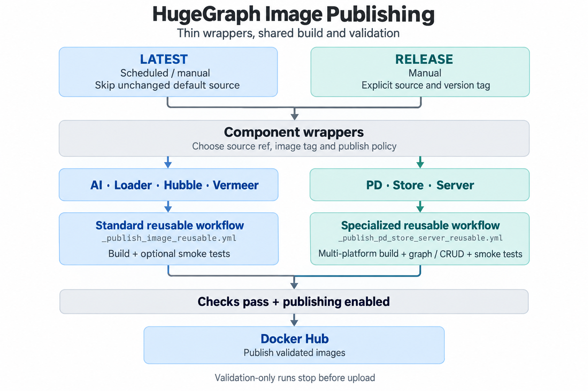
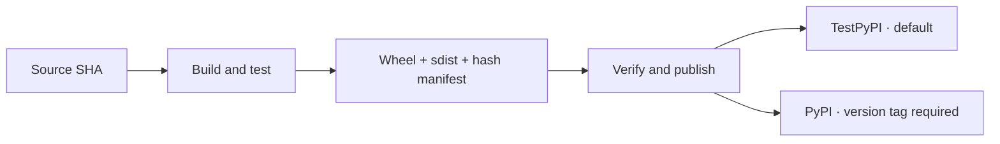

# HugeGraph Actions

Shared workflows for publishing HugeGraph Docker images and Python packages, validating releases, and repository automation.

## Image publishing architecture



Wrappers define when and what to publish; the two reusable workflows implement image building and validation. Each run resolves its source repository/ref to a fixed commit.

## Docker images

Thin component wrappers call either [the standard image publisher](.github/workflows/_publish_image_reusable.yml) or [the PD/Store/Server publisher](.github/workflows/_publish_pd_store_server_reusable.yml).

| Mode | Trigger | Source and tag | Unchanged source |
| --- | --- | --- | --- |
| Latest | Scheduled or manual | Default source uses `latest`; other refs can derive a tag or use `image_tag` | Skipped only for the configured default source without an explicit tag |
| Release | Manual | Explicit `source_ref`; standard images can derive the version, PD/Store/Server requires `image_tag=x.y.z` | Always runs |

Manual latest runs default to validation (`publish=false`): build all configured platforms and read caches without pushing images, exporting caches, or updating `LAST_*_HASH`. Scheduled runs publish automatically. Set `publish=true` to publish manually; use an explicit `image_tag` for branch builds.

Use `source_repository` to select the component's Apache or HugeGraph repository and `source_ref` for a branch, tag or commit. The resolved source SHA and destination `image_tag` are independent.

The standard publisher selects Dockerfiles, build contexts, platforms and optional smoke tests through `build_matrix_json`. Images carry OCI source/revision labels. Successful latest publications can update `LAST_*_HASH`.

### PD/Store/Server validation

```text
Resolve source SHA and tag
  → Build/load PD, Store, HStore Server and standalone Server (amd64 + arm64)
  → Run local compose, example graph and Gremlin CRUD checks
  → Smoke-test standalone Server
  → Push the same multi-platform candidates
  → Update latest hash, when enabled
```

Sources with `docker/bake.hcl` share one native Maven build and registry cache (`hugegraph/hugegraph:shared-<channel>`); older sources use the per-Dockerfile path. Compose uses `docker/docker-compose.dev.yml` with `pull_policy: never`, or the compatible `docker/docker-compose.yml` fallback.

The precheck imports the bundled `example.groovy`, verifies its 6 vertices/6 edges, and exercises Gremlin CRUD before returning to that baseline. Runtime checks use the locally loaded amd64 images. Only successful candidates are pushed, without rebuilding or temporary architecture tags.

The runner uses 1 PD + 1 Store + 1 Server, with 1 GiB each for PD/Store and 1.5 GiB for Server. These are CI limits, not production sizing. A full 3+3+3 topology requires a larger runner or another validated test setup.

### Multi-platform builds

Use `FROM --platform=$BUILDPLATFORM` for portable build stages so Maven/Node packaging runs natively; leave runtime stages on the target platform. Native libraries, JNI/CGO and architecture-specific downloads need cross-compilation or native target runners plus runtime tests. See [Docker's build strategies](https://docs.docker.com/build/building/multi-platform/) and [platform arguments](https://docs.docker.com/reference/dockerfile/#automatic-platform-args-in-the-global-scope).

## Python packages

[`publish_python.yml`](.github/workflows/publish_python.yml) publishes `hugegraph-python` from `apache/hugegraph-ai`.

| Input | Default | Meaning |
| --- | --- | --- |
| `source_ref` | `main` | Branch, tag or SHA; resolved to an immutable commit |
| `target` | `testpypi` | `testpypi` or `pypi`; production requires a tag exactly matching the package version |

Create environments `testpypi` and `pypi`, each containing `PYPI_API_TOKEN`. Restrict `pypi` deployments to the `master` branch of this repository and require maintainer approval with admin bypass disabled; `testpypi` allows branch validation. This restriction applies to the workflow branch, not the source package tag. Only the upload step receives the selected token.



The build job uses uv, checks wheel/sdist with Twine, records their hashes, and runs isolated installation and client tests on Python 3.10/3.11. It verifies the artifacts again after tests. The publish job checks the manifest and remote filenames/hashes before uploading those exact artifacts. Unexpected remote files or conflicting hashes fail; identical files are skipped. For partial uploads, **re-run failed jobs** to reuse the original artifacts.

<details>
<summary>Development checks</summary>

Local checks (no upload):

```bash
uv run --no-project --python 3.11 python -m unittest discover -s tests -p 'test_python_release.py' -v
actionlint .github/workflows/publish_python.yml
```

</details>

A new manual workflow must first reach the default branch to register dispatch; subsequent runs can select another workflow branch with `gh workflow run --ref`.

## Maintenance

Browse the [workflow directory](.github/workflows) for component entry points. Keep trigger policy and component settings in wrappers, shared build behavior in reusable workflows, and preserve the distinct latest/release semantics. Use dedicated workflows for different validation or sequencing requirements.
